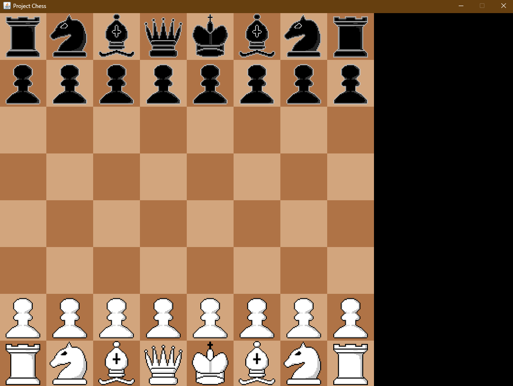
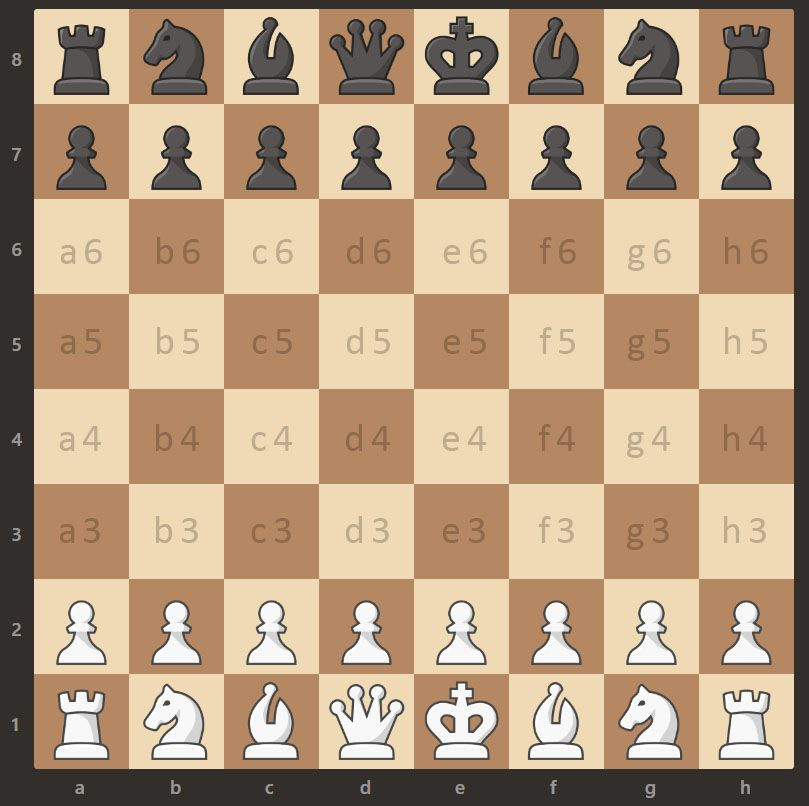
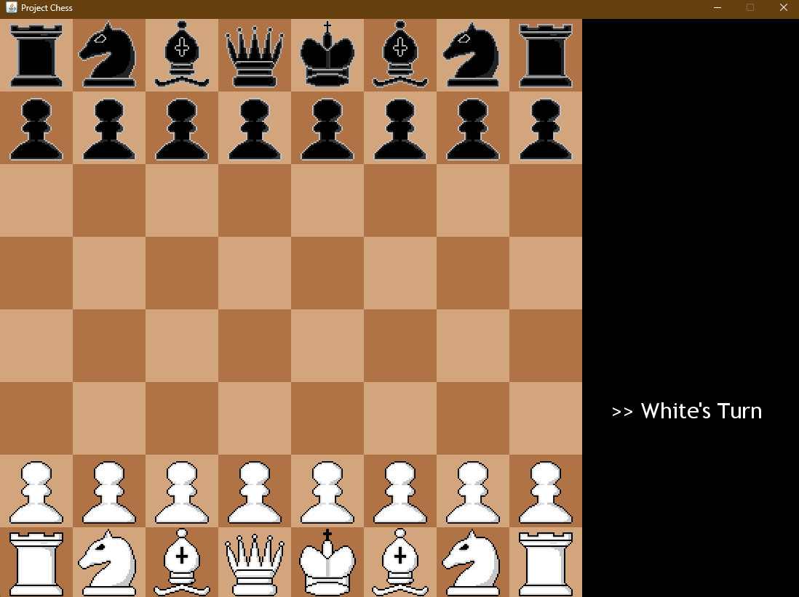

# Project Chess

<p align="center">
  
</p>

## Description

This project is a simple chess game made using vanilla Java. It can be played on a computer. It has a UI which allows users to interact with the game using mouse events. The game includes a fully functional chessboard and pieces, with the ability to move pieces according to the rules of chess.

<p align="center">
  
</p>

## Features

- **Graphical User Interface (GUI)**: The game features a graphical interface where users can see the chessboard and pieces.
- **Mouse Interaction**: Users can interact with the game using mouse clicks to select and move pieces.
- **Game Loop**: The game runs in a separate thread to ensure smooth rendering and updates.
- **Piece Setup**: The game initializes with all chess pieces set up in their standard starting positions.
- **Rendering**: The chessboard and pieces are drawn using Java's `Graphics2D` class.
- **Check and Checkmate Detection**: The game can detect check and checkmate conditions.
- **Pawn Promotion**: The game supports pawn promotion.
- **Castling**: The game supports castling moves.
- **Stalemate Detection**: The game can detect stalemate conditions.

## How to Run

1. Clone the repository.
2. Navigate to the project directory.
3. Use Maven to build the project:
    ```sh
    mvn clean install
    ```
4. Run the application:
    ```sh
    mvn exec:java -Dexec.mainClass="dev.mayank.app.ChessApp"
    ```

<p align="center">
  
</p>

## Code Structure

- **GamePanel.java**: Manages the game loop, rendering, and user interactions.
- **ChessBoard.java**: Handles the drawing of the chessboard.
- **ChessPiece.java**: Represents individual chess pieces and their behaviors.
- **Mouse.java**: Listen for mouse events to handle piece selection and movement.
- **King.java**: Represents the King piece and its specific movements.
- **Queen.java**: Represents the Queen piece and its specific movements.
- **Bishop.java**: Represents the Bishop piece and its specific movements.
- **Knight.java**: Represents the Knight piece and its specific movements.
- **Rook.java**: Represents the Rook piece and its specific movements.
- **Pawn.java**: Represents the Pawn piece and its specific movements.

## Future Enhancements

- Improve the user interface with better graphics and animations.
- Implement an AI opponent to play against.
- Add sound effects for moves and captures.
- Enhance the game with additional features like move history and undo functionality.

## Contributing

1. Fork the repository.
2. Create a new branch (`git checkout -b feature-branch`).
3. Make your changes.
4. Commit your changes (`git commit -m 'Add some feature'`).
5. Push to the branch (`git push origin feature-branch`).
6. Open a pull request.

## License

This project is licensed under the MIT License — see the `LICENSE` file for details.