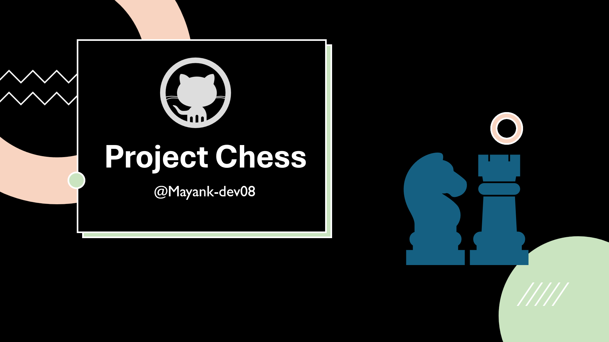

# Project Chess

## Description

This project is a simple chess game made using vanilla Java. It can be played on a computer. It has a UI which allows users to interact with the game using mouse events. The game includes a fully functional chessboard and pieces, with the ability to move pieces according to the rules of chess.

## Features

- **Graphical User Interface (GUI)**: The game features a graphical interface where users can see the chessboard and pieces.
- **Mouse Interaction**: Users can interact with the game using mouse clicks to select and move pieces.
- **Game Loop**: The game runs in a separate thread to ensure smooth rendering and updates.
- **Piece Setup**: The game initializes with all chess pieces set up in their standard starting positions.
- **Rendering**: The chessboard and pieces are drawn using Java's `Graphics2D` class.

## How to Run

1. Clone the repository.
2. Navigate to the project directory.
3. Use Maven to build the project:
    ```sh
    mvn clean install
    ```
4. Run the application:
    ```sh
    mvn exec:java -Dexec.mainClass="dev.mayank.app.ChessApp"
    ```



## Code Structure

- **GamePanel.java**: Manages the game loop, rendering, and user interactions.
- **ChessBoard.java**: Handles the drawing of the chessboard.
- **ChessPiece.java**: Represents individual chess pieces and their behaviors.
- **Mouse.java**: Listen for mouse events to handle piece selection and movement.

## Future Enhancements

- Implement game state updates to handle piece movements and game rules.
- Add more detailed descriptions and comments in the code.
- Improve the user interface with better graphics and animations.